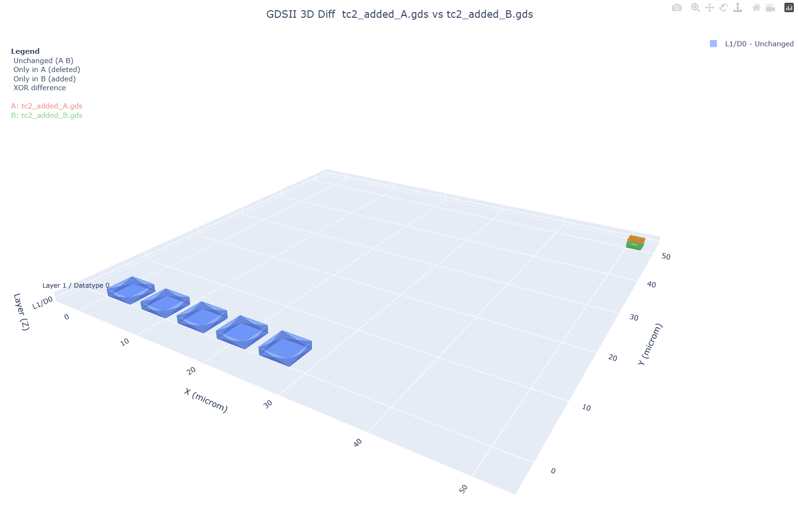

# GDSII Comparison Tool

## Quick Start
Based on shapely and gdspy Python packages. To run the algorithm, follow the steps below to create a Python environment and run the single test.
```bash
python3 -m venv .venv
source .venv/bin/activate
pip install -r requirements.txt
# Make PCB configuration you would like to test in run_single.py
python3 gdsii_diff_3d.py input_a.gdsii input_b.gdsii --output model.html
```

After, the result is output into an interactable HTML page with the differing regions.



In addition, JSON and text reports are available. Examples are shown in the test output folder.

## Structure
The following folders are described as:
- Test: Test cases input files for evaluation of the algorithm.
- Output: HTML model, JSON, and text reports for each test case.
- Images: Sample test images.